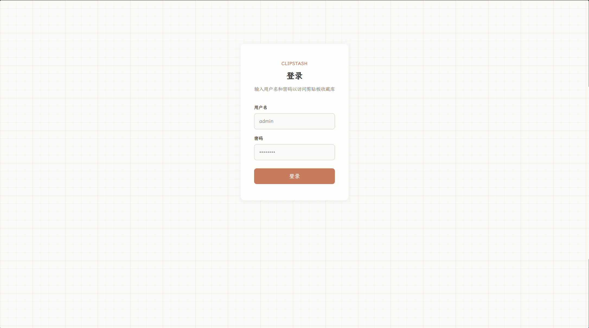
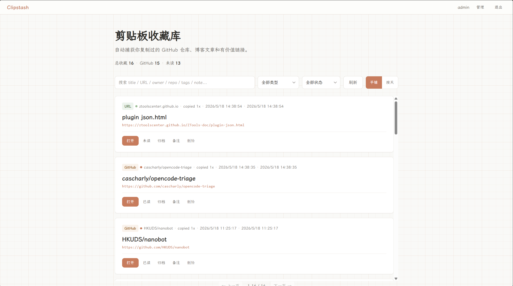

# Clipstash

<div align="center">
  
  
  <p><strong>从剪贴板自动收藏值得回看的链接</strong></p>
  
  <p>服务端/客户端分离部署 · Token 鉴权 · WebUI 管理 · SQLite 存储</p>
</div>

---

## 📸 界面预览

### 登录页面


### 收藏管理


---

## ✨ 功能特点

- 📋 **剪贴板监听** — 自动捕获 GitHub 仓库和普通 URL 链接
- 🖥️ **Server/Client 分离** — 服务端集中存储，客户端监听各自剪贴板并推送
- 🔐 **Token 鉴权** — Bearer Token 认证，WebUI 管理用户和令牌
- 💾 **本地数据库** — 服务端使用 SQLite 存储收藏内容和状态
- ️ **状态管理** — 未读、已读、归档，帮助整理收藏
- 🔄 **智能去重** — 自动识别重复链接，合并 `seen_count`
- 🌐 **Web UI** — 登录 → 查看、搜索、标记、编辑备注和标签
- ️ **迁移机制** — 数据库结构升级安全，历史数据不丢失

---

## 🚀 快速开始

### 方式一：全局安装（推荐）

本项目使用 [git-publish](https://github.com/privatenumber/git-publish) 发布，可直接通过 GitHub 分支安装：

```bash
pnpm i 'me9rez/node-clipstash#npm/master' -g
```

安装后即可直接使用 `clipstash` 命令。

### 方式二：从源码安装

```bash
git clone https://github.com/me9rez/node-clipstash.git
cd node-clipstash
pnpm install
pnpm run build
pnpm run start:server
```

首次启动会自动创建管理员账户，访问 `http://localhost:3879` 即可使用。

---

## 📦 使用指南

全局安装后可直接使用 `clipstash` 命令：

```bash
clipstash server   [--port <port>]                     # 启动 API 服务端 + WebUI
clipstash client   [--server <url>] [--token <tok>]    # 启动剪贴板监听客户端
clipstash list     [--server <url>] [--token <tok>]    # 列出收藏条目
clipstash admin    <subcommand>                        # 管理用户和令牌
```

### ① 启动服务端

```bash
# 直接运行
clipstash server

# 自定义端口
clipstash server --port 3000
```

首次启动会打印管理员凭据：

```
=== 首次启动 — 管理员凭据 ===
用户名: admin
密码:   xxxxxxxxxxxxxxxx
令牌:   xxxxxxxxxxxxxxxxxxxxxxxxxxxxxxxxxxxxxxxxxxxxxxxxxxxxxxxxxxxxxxxx
请立即登录 WebUI 修改密码！
==============================
```

访问 `http://localhost:3879` 打开 WebUI，用管理员凭据登录。

### ② 启动客户端

客户端监听本机剪贴板，将解析到的链接推送到服务端：

```bash
# 使用环境变量
$env:CLIPSTASH_SERVER_URL = "http://192.168.1.100:3879"
$env:CLIPSTASH_TOKEN = "your-token-here"
clipstash client

# 使用命令行参数
clipstash client --server http://192.168.1.100:3879 --token your-token-here

# 禁用桌面通知
clipstash client --no-notify
```

###  查看收藏

```bash
# 本地数据库
clipstash list

# 远程服务端
clipstash list --server http://192.168.1.100:3879 --token your-token-here
```

### ④ 管理用户和令牌

```bash
# 列出所有用户和令牌（掩码显示）
clipstash admin list

# 重置用户密码
clipstash admin reset admin

# 为用户生成新令牌
clipstash admin token admin my-client
```

---

## 🌐 WebUI 管理

登录后可以：

- **浏览收藏**：平铺/按天分组，搜索、筛选类型和状态
- **标记状态**：未读 → 已读 → 归档
- **编辑条目**：添加标签和备注
- **管理面板**（管理员可见）：
  - 创建/删除用户
  - 生成/复制/删除 API 令牌（用于客户端连接）

---

## 🛠️ 开发

### 环境要求
- Node.js 22+
- pnpm 10+

### 开发命令

| 命令 | 说明 |
|------|------|
| `pnpm install` | 安装依赖 |
| `pnpm run build` | 前端 + tsdown 打包 |
| `pnpm run type-check` | TypeScript 类型检查 |
| `pnpm run test` | 运行测试 |
| `pnpm run start:server` | API 服务 (端口 3879) |
| `pnpm run dev:web` | Vite 前端 (端口 5173) |

开发模式需同时运行两个终端：
```bash
pnpm run start:server  # API 服务 (端口 3879)
pnpm run dev:web       # Vite 前端 (端口 5173，/api 代理到 3879)
```

---

##  项目结构

```
├── src/
│   ├── cli.ts           # CLI 入口 (server / client / list)
│   ├── server.ts        # Hono API + 静态文件
│   ├── client.ts        # 客户端剪贴板推送
│   ├── watcher.ts       # 剪贴板轮询
│   ├── parser.ts        # URL / GitHub 解析
│   ├── db.ts            # SQLite 数据库操作
│   ├── migration.ts     # 数据库迁移
│   ├── auth.ts          # 鉴权（密码哈希、Token、中间件）
│   ├── notify.ts        # 桌面通知
│   └── types.ts         # 共享类型
── web/
│   └── src/             # Vue 3 前端
│       ├── App.vue      # 主页面
│       ├── Login.vue    # 登录页
│       ├── AdminPanel.vue # 管理面板
│       ├── api.ts       # API 客户端
│       └── auth.ts      # 前端 Token 管理
├── data/                # 运行时数据（自动创建）
│   └── clipmark.db      # SQLite 数据库
├── dist/                # tsdown 构建产物
├── web/dist/            # Vite 前端构建产物
├── tsdown.config.ts     # tsdown 构建配置
└── vitest.config.ts     # vitest 测试配置
```

---

## 🔌 API 端点

| 方法 | 路径 | 鉴权 | 说明 |
|------|------|------|------|
| `GET` | `/api/health` | 否 | 健康检查 |
| `POST` | `/api/auth/login` | 否 | 登录获取 Token |
| `GET` | `/api/auth/me` | 是 | 当前用户信息 |
| `POST` | `/api/auth/change-password` | 是 | 修改密码 |
| `GET` | `/api/stats` | 是 | 统计数据 |
| `GET` | `/api/items` | 是 | 列出条目（支持分页/筛选） |
| `POST` | `/api/items` | 是 | 客户端推送条目 |
| `GET` | `/api/items/:id` | 是 | 获取单个条目 |
| `PATCH` | `/api/items/:id` | 是 | 更新条目 |
| `DELETE` | `/api/items/:id` | 是 | 删除条目 |
| `GET` | `/api/users` | 是(admin) | 用户列表 |
| `POST` | `/api/users` | 是(admin) | 创建用户 |
| `DELETE` | `/api/users/:id` | 是(admin) | 删除用户 |
| `GET` | `/api/tokens` | 是 | 令牌列表 |
| `POST` | `/api/tokens` | 是 | 生成令牌 |
| `DELETE` | `/api/tokens/:id` | 是 | 删除令牌 |

---

## ⚙️ 环境变量

| 变量 | 说明 | 默认值 |
|------|------|--------|
| `CLIPSTASH_PORT` | 服务端端口 | `3879` |
| `CLIPSTASH_SERVER_URL` | 客户端连接地址 | `http://127.0.0.1:3879` |
| `CLIPSTASH_TOKEN` | 客户端认证令牌 | - |
| `CLIPSTASH_CORS_ORIGIN` | 额外 CORS 允许域 | - |
